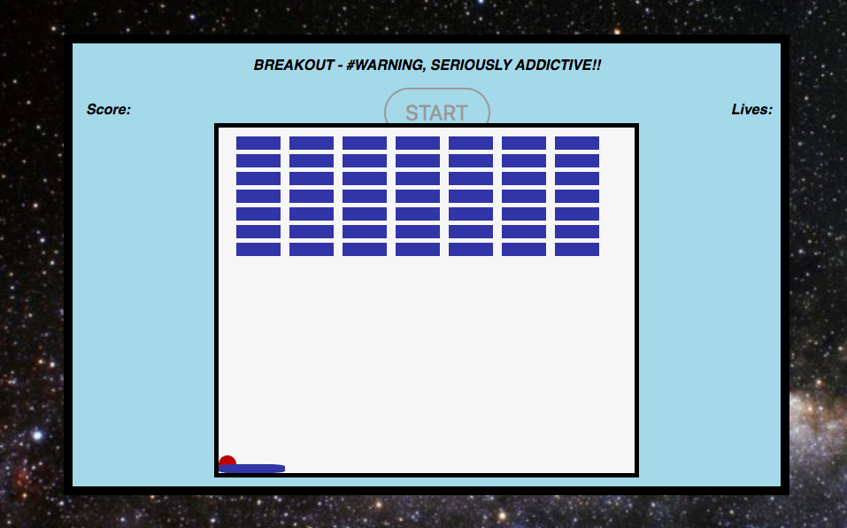
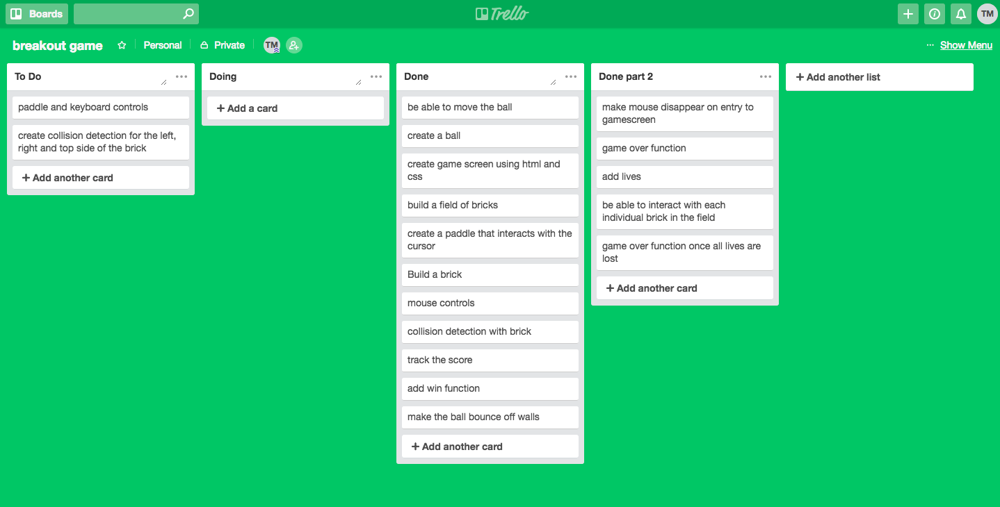

# Breakout 

--

*A highly addictive game produced using the AGILE methodology*



## Rules 
 * Destroy all of the bricks before you lose all lives
 * Lives can be lost if the ball hits the bottom of the game screen
 
## Programmes used 
 * HTML5
 * CSS
 * JavaScript
 * JQuery
 
## How to download locally
 * Clone the SSH key to your local terminal which will create a local version of the repository
 * Open the repository using atom or your engine of choice
 * Open the Index.html for access to the full game
 
## Development



### Breakdown of tasks required for MVP (Minimum Viable Product)

* Create a game screen using CSS and HTML5
* Produce a moving ball that interacts with the boundaries of the game screen
* Implement an interactable paddle that interacts with the cursor
* Have a rrunning score function
* Implement prameters which allow for the game to be won
* Introduce a game over function

### Challenges faced

--

#### Collision detection -

* The most difficult challenge faced in the production of this game was the **collision detection** function. The reasoning for this is the sheer number of parameters needed to produce the required affect.

*  The first step was defining the boundaries of each brick (independent of others around them) as well as the ball.

```
   brickLeft = $this.offset().left;
   brickTop = $this.offset().top;
   brickRight =  brickLeft + $this.outerWidth();
   brickBottom =  brickTop + $this.outerHeight();

   var ballLeft = $ball.offset().left;
   var ballTop = $ball.offset().top;
   var ballRight = ballLeft + $ball.outerWidth();
   var ballBottom = ballTop + $ball.outerHeight();
```   
*  The next step was to make the collision function work which required the ball to be in the same X and Y axis of the brick.

```
   if (ballTop <= brickBottom && ballLeft <= brickRight && ballRight >= brickLeft) {
    brickCollisionBottom($("#"+i), i);
   }
```
* The final step was to make sure the ball bounced back towards the paddle once it hit the brick, and not just keep on going to the game screen boundary

```
  function brickCollisionBottom($this, i) {
    $('#'+i).css({display: "none"});
    directionY = "+";
    score += 10;
    $("#score").html(score);
    smashSound();
  }
```  

#### Ball starting position

* Another challenging function was making the ball start on the paddle rather than the top left hand corner of the game screen. The code i used to fix this is a follows:

```
  function ballStartPosition() {
    posX = ($paddle.offset().left - 375) + $paddle.outerWidth()/2;
    posY = 360;
    directionX = "+";
    directionY = "+";
    $ball.css({'left': posX + "px"});
    $ball.css({"top" : posY + "px"});
  }
```     

## Extra features to be added
 * Create keyboard controls for the paddle
 * Create seperate collision detections for the left, right and top side of the brick
 * Create different levels to be played
 * Create a highscore system
 * Create didferent ball rebounds depending on where it hit the paddle
 * Animations for when a brick is destroyed


